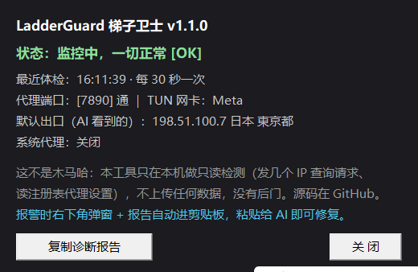

# LadderGuard 梯子卫士 🪜🚨

**给用 AI 的兄弟姐妹保命用的。**

你有没有遇到过：

- Claude 用着用着突然被封号，一看——节点悄悄掉了，AI 看到了你的真实 IP
- Clash Verge 更新之后 TUN 悄悄失效，你以为梯子还在，其实全机裸奔
- 挂着香港节点就敢上 GPT，封号套餐直接安排
- 开着系统代理以为自己很安全，其实 AI 桌面客户端根本不理系统代理

**LadderGuard 就是防这些的**：一个常驻后台的小监控，每 30 秒体检一次梯子，
出事立刻在右下角弹大窗报警 + 自动把诊断报告复制到剪贴板——你直接粘贴给 AI
（Claude / ChatGPT / ZCode 都行），它一看就懂，马上给你修。

> 一句话：**TUN 掉了它比 Claude 客服先知道。**

---

## 它盯什么

| 检测项 | 触发条件 | 后果（不装的话） |
|---|---|---|
| 💀 流量裸奔 | 普通软件出口 = 国内真实 IP | AI 看到你家宽带地址，Claude 直接封 |
| 💀 TUN 失效 | TUN 网卡消失 / 配置开着但没生效 | 只有浏览器在走代理，桌面 App 全裸奔 |
| 💀 高危地区 | 出口在香港 / 澳门 / 俄罗斯等 | Claude/GPT/Gemini 不支持地区 = 封号加速包 |
| ⚠️ 系统代理 | 系统代理开着 | 浏览器安全了，桌面客户端照样裸奔。**系统代理 = 找死** |
| ⚠️ 节点跳国家 | JP → US 这类国家切换 | AI 风控判定异地登录 |
| ⚠️ IP 频繁跳变 | 10 分钟内出口 IP 换 3 次+ | 动态 IP 池 = 风控最爱 |
| ⚠️ IPv6 泄漏 | 真实 IPv6 绕过 TUN 直连 | TUN 白开，v6 在裸奔 |
| ⚠️ 内核挂了 | 本地代理端口全不通 | 梯子已断，赶紧修 |

报警窗口长这样（深色、置顶、右下角、可拖动）：

- 每个问题一行标题 + 原因 + **绿色处理步骤**（跟着点就行）
- **诊断报告已自动复制到剪贴板**，粘贴给 AI 即可，不用你描述半天
- 三个按钮：`复制诊断报告` / `30分钟后再说` / `关闭`


托盘左键的状态面板（自带"这不是木马"说明，避免小白恐慌）：



## 为什么是"系统代理 = 找死"

系统代理只是个"建议"，浏览器听，**AI 桌面客户端、命令行工具、Electron 应用
很多根本不听**，它们直连出去，AI 服务端看到的就是你的家宽 IP。
TUN 模式是网络层接管，所有流量都得过梯子——**用 AI，请开 TUN，关系统代理。**

## 安装（3 步）

1. 下载 `LadderGuard.exe`，放到一个固定的目录（比如 `D:\TOOLS\LadderGuard\`）
2. 双击运行——右下角托盘会出现**绿色梯子图标**，这就是它在干活
3. 挂开机自启，`cmd` 里执行：

```cmd
LadderGuard.exe -install-autostart
```

完事。以后开机自动上岗，出事弹窗，没事一声不吭。

## 托盘图标（看得见，才不像木马）

程序运行后，任务栏右下角常驻一个梯子图标：

- 🟢 **绿色** = 梯子正常 ｜ 🔴 **红色** = 检测到问题
- **左键** = 状态面板：当前状态、出口 IP、最近体检时间 + 大白话说明
- **右键** = 菜单：立即体检 / 复制诊断报告 / 状态面板 / 开机自启开关 / **退出**

> 担心是木马？源码就一个 `main.go`（纯 Go 标准库），全程只发几个 IP 查询请求、
> 读注册表代理设置，不上传任何数据，没有后门，编译命令就一行，全程可复现。

## 常用命令

```cmd
LadderGuard.exe -diag                  :: 手动全量体检，打印报告（在 cmd/PowerShell 里跑）
LadderGuard.exe -test=all              :: 假报警演示，看看弹窗长啥样
LadderGuard.exe -install-autostart     :: 挂开机自启
LadderGuard.exe -uninstall-autostart   :: 取消开机自启
LadderGuard.exe -version               :: 看版本
```

> `-diag` 和 `-install-autostart` 请在 **cmd / PowerShell / Windows Terminal** 里跑，
> 别在 Git Bash 里跑（GUI 程序在 mintty 里没有输出）。

## 配置（可选）

首次运行会在 exe 同目录生成 `config.json`，不改也能用。想改的话：

```json
{
  "interval_sec": 30,            // 检测间隔，最小 10
  "proxy_ports": [7890, 7897],   // 本地代理端口探测列表
  "expect_tun": true,            // 你不用 TUN 就改 false（但不建议）
  "warn_system_proxy": true,     // 开系统代理时要不要骂你
  "risky_regions": ["CN", "HK", "MO", "RU", "BY", "KP", "IR", "SY", "CU", "AF"],
  "country_change_alert": true,  // 跳国家报警
  "flap_window_min": 10,         // IP 跳变统计窗口（分钟）
  "flap_count": 3,               // 窗口内变几次算频繁
  "alert_cooldown_min": 30,      // 同一个问题最少间隔多久再弹一次
  "service_check": false         // true = 顺带测 Claude/OpenAI 有没有拉黑当前节点 IP（默认关，防误报）
}
```

数据文件在 `%APPDATA%\LadderGuard\`：`state.json`（出口记录）、`LadderGuard.log`（日志，超 512KB 自动轮转）。

## 占用

- 常驻内存：约 **10~18 MB**（单进程，含托盘图标）
- 网络：每 30 秒约 3 个小请求（出口 IP 检测，走的是你自己的梯子路径）
- 纯 Go 标准库编译，**没有任何运行时依赖**，不用装 Python / Node / .NET

## 工作原理（给较真的人）

1. **默认路径出口检测**：程序自己发 HTTP 请求且**无视系统代理**——这测的就是
   "一个普通软件实际看到的出口"，等于 AI 客户端的视角。出口是国内 = 泄漏。
2. **代理路径出口检测**：显式挂 `127.0.0.1:7890` 再测一次，验证内核和节点本身好不好。
3. **TUN 检测**：找 198.18.0.0/15 地址的网卡或 Meta/Clash/Mihomo 命名的网卡。
4. **系统代理**：读注册表 `ProxyEnable` / `ProxyServer`。
5. **真实 IP**：通过国内源（4.ipw.cn 等）获取你的宽带 IP，写进诊断报告。
6. **Clash Verge 配置对照**：读 `verge.yaml`，配置说 TUN 开着但实际没生效时，
   报告会直接点破"更新把服务搞坏了"，AI 一眼定位。
7. 弹窗是纯 Win32 API 自绘的，无 GUI 框架依赖。

### 检测不到的（别迷信）

- 浏览器 WebRTC 泄漏（浏览器内部行为，建议浏览器装个 WebRTC 控制扩展）
- DNS 精细泄漏分析
- 节点 IP 被 AI 服务拉黑（可开 `service_check` 粗测，可能误报）

## 自己编译

```cmd
go build -o LadderGuard.exe -ldflags "-s -w -H=windowsgui"
```

Go 1.21+，零第三方依赖，`go.mod` 都不用拉包。

## 卸载

```cmd
LadderGuard.exe -uninstall-autostart
taskkill /f /im LadderGuard.exe
del LadderGuard.exe
```

## 免责声明

本工具只在本机做只读检测（发几个 IP 查询请求、读注册表和网卡信息），
不上传任何数据，没有后门。它不能保证你的号不被封——但能堵住 90% 的
"梯子悄悄坏了你不知道"这种送命题。

---

*献给所有被封过 Claude 号的勇士。愿你的 TUN 永远在线，出口永远是东京。*
